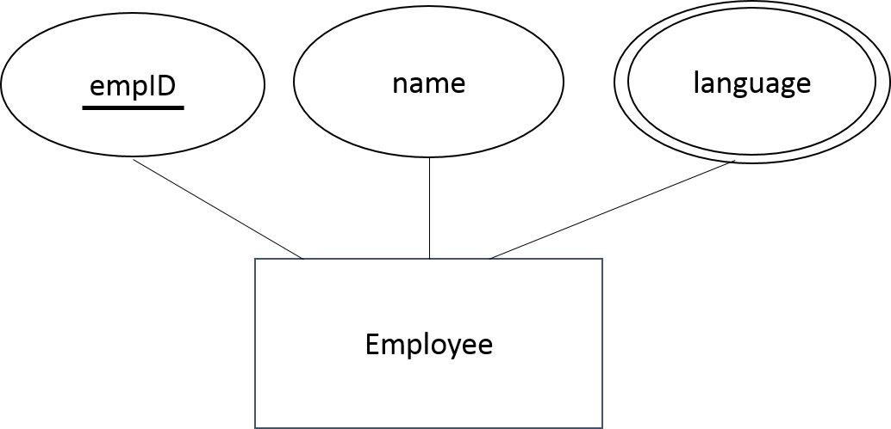
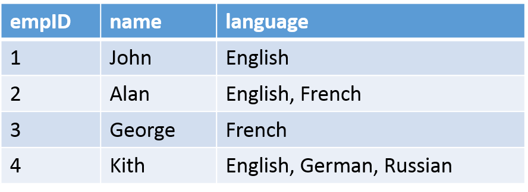
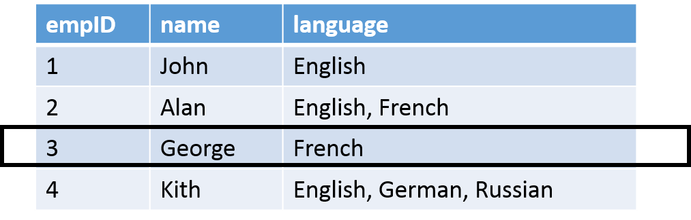
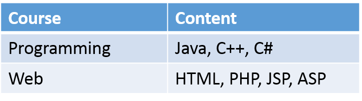

# Database Normalization

## Database anomalies
* Updation anomalies
  * If data items are scattered and are not linked to each other properly, then it could lead to inconsistencies and operational overheads. Ex. If user tries to update one data item having its copies scattered over several places, few instances may get updated properly while many others will be left with old values that leads to inconsistent state. 
  Updation anomalies can be prevented  by simply building consistent relationship between tables using foreign keys, and if tuple is updated from referenced relation and referenced attribute value is being used, a cascade on update mechanism can be implemented to maintain data consistency and integrity. 

* Deletion anomalies 
  * A deletion anomaly is the unintended loss of data due to deletion of other data which results in database inconsistencies and it is an example of how combining information that does not really belong together into one table can cause problems.

* Insertion anomalies  
  * An insertion anomaly is the inability to add data to the database due to the absence of other data, this results in database inconsistencies due to omission. This usually occures when user tries to insert data in a record that does not exist.

* Normalization is a method to remove all these anomalies and bring the database to a consistent state

## What is Normalization
* The process by which we efficiently organize data to achieve these goals:
  * Eliminating redundancy
  * Ensuring data is stored in the correct table
  * Eliminating need for restructuring database when data is added

* There are five and more levels of normal forms but third normal form is sufficient for most typical databases.

## Problem without normalization
* Without Normalization, it becomes difficult to handle data smoothly.
* Insertion, Update and Deletion anomalies are very frequent if the database is not normalized

## Normalization overview
* Normalization is a process of organizing the data in database to avoid data redundancy, insertion anomaly, update anomaly and deletion anomaly.

* The most commonly used normal forms:
  * First normal form (1NF)
  * Second normal form (2NF)
  * Third normal form (3NF)
  * Boyce & Codd normal form (BCNF)**

## 1st Normal Form
First normal form: 
 * An attribute (column) of a table cannot hold multiple values. It should hold only atomic values. 
 * Each column should have unique name
 * Each column should contain values of same type. 
 * No duplicate rows

## 1st normal form

## 1st normal form

* SELECT: Are all possible queries feasible to be expressed? 
* INSERT: Can new data be inserted without requiring complicated queries?
* DELETE: Can data be deleted without losing valuable information? 
* UPDATE: Can data modification be performed in an easy way and without modifying data that should not be affected?

## 1st normal form – select failure

SELECT *
FROM employee
WHERE language = ‘English’

Potential solution:
SELECT *
FROM employee
WHERE language LIKE ‘%English%’

## 1st normal form – update failure

What happens if we want to add ‘English’ language to George?

We need to know that he already speaks French:
UPDATE employee
SET language = ‘French, English’
WHERE name = ‘George’

## 1st normal form – An alternative approach

## 1st normal form – New problems
* Storage: More storage is required for data that are not needed
* SELECT: It is easier to perform. Employees that speak a specific language are easier to be found.
* INSERT: Data insertion is problematic. 
* UPDATE: Data update is easy to perform.
* DELETE: Data deletion is easy to perform

## 1st normal form
### Example 1:

* First normal form: An attribute (column) of a table cannot hold multiple values. It should hold only atomic values   

### Example 2:
<table>
<tbody><tr>
<th>EmployeeID</th>
<th>FirstName</th>
<th>LastName</th>
<th>TelephoneNumber</th>
</tr>
<tr>
<td>1</td>
<td>Jon</td>
<td>Jones</td>
<td>985-841-3025</td>
</tr>
<tr>
<td>2</td>
<td>Jane</td>
<td>Constantine</td>
<td>219-776-4100 574-403-1659</td>
</tr>
<tr>
<td>4</td>
<td>Marha</td>
<td>Fernandinho</td>
<td>588-008-9773</td>
</tr>
</tbody></table>

 * The following example show's that same table in 1NF.
  <table>
<tbody><tr>
<th>EmployeeID</th>
<th>FirstName</th>
<th>LastName</th>
<th>TelephoneNumber</th>
</tr>
<tr>
<td>1</td>
<td>Jon</td>
<td>Jones</td>
<td>985-841-3025</td>
</tr>
<tr>
<td>2</td>
<td>Jane</td>
<td>Constantine</td>
<td>219-776-4100</td>
</tr>
<tr>
<td>2</td>
<td>Jane</td>
<td>Constantine</td>
<td>574-403-1659</td>
</tr>
<tr>
<td>4</td>
<td>Marha</td>
<td>Fernandinho</td>
<td>588-008-9773</td>
</tr>
</tbody></table>     

## 1st normal form

## 1st normal form
* The multivalued attribute is turned into a “Many-to-Many” relationship

## 1st normal form – In a nutshell
* First normal form (1NF) sets the very basic rules for an organized database
  * There are no repeating or duplicate fields
  * Each cell contains only a single value
  * Each record is unique (identified by a primary key)

## Functional Dependencies
* A functional dependency is defined as an association among a table’s attributes
  * Suppose that given the value of one attribute, we can obtain the value of another attribute
* An attribute B is considered as functional dependent to an attribute A if the value of A sets uniquely the value of B
* The aforementioned association is depicted as Α → Β
  * Read as: A determines B or B depends on A

## Functional dependencies – example 1
Examples of functional dependencies:
* ZipCode → AddressCity
  * 16652 is Huntingdon’s ZIP
* ArtistName → BirthYear
  * Picasso was born in 1881
* Autobrand → Manufacturer, Engine type
  * Pontiac is built by General Motors with gasoline engine
* Author, Title → PublDate
  * Shakespeare’s Hamlet was published in 1600

## Functional dependencies – example 2

We say an attribute B has a functional dependency on another attribute A, if for any two records, which have the same value for A, then the values for B in these two records must be the same

## Functional dependencies – example 3

Knowing the Team name we can identify uniquely the League it participates

## Functional dependencies – example 4

## Functional dependencies
* A functional dependency can be full or partial
  * Full dependency
  * Partial dependency
* A partial dependency is a situation where a non-prime attribute is functionally dependent to a portion/part of a primary key/Candidate key
* A functional dependency is a full functional dependency when the removal of any attribute means that the dependency does not hold any more

## 2nd Normal Form
Second normal form: an entity type is in second normal form (2NF) when it is in 1NF and every non-key attribute, any attribute that is not part of the primary key, is fully dependent on the primary key. Appears mostly in situation where many to many relationship exists. 

## 2nd Normal Form – example 1

2NF: No non-prime attribute is dependent on the proper subset of any candidate key of the table

## 2nd Normal Form – example 1
* Primary key is composite
  * Comprises of ‘Title’ and ‘Actor’ attributes
* The following functional dependencies occur:
  * {title, actor} → director
  * title → director

## 2nd normal form – Approach

### Example 1
* We split the initial table to the following two:

### Example 2

{Manufacturer, Model} → Manufacturer Country

* We split the initial table to the following two:

### Example 3

| Manufacturer (PK) | Model (PK)  | ManufacturerCountry | ManufacturerCountryCode |
| ----------------- | ----------- | -------------------- | ------------------------- |
| Apple             | MacBook Air | United States        | US |
| Apple             | Macbook Pro | United States        | US |
| Lenovo            | ThinkPad    | China                | CN |
| Lenovo            | IdeaPad     | China                | CN |

**Countries**

| CountryCode (PK) | CountryName  |
| ----------------- | ------------- |
| US                | United States |
| CN                | China         |

**Models**

| ID (PK) | Name        | ManufacturerID (FK) |
| ------- | ----------- | -------------------- |
| 1       | MacBook Air | 1                    |
| 2       | Macbook Pro | 1                    |
| 3       | ThinkPad    | 2                    |
| 4       | IdeaPad     | 2                    |

**Manufacturers**

| ID (PK) | Name         | CountryCode (FK) |
| ------- | ------------ | ----------------- |
| 1       | Apple        | US                |
| 2       | Lenovo       | CN                |

## 2nd normal form – In a nutshell
* A table is said to in second normal form (2NF) if the following conditions hold:
  * Table is in first normal form (1NF)
  * Table should not contain partial dependencies.      
  * Each table must contain data about only one type of thing.

## 3rd Normal Form
Third normal form: an entity type is in third normal form (3NF) when it is in 2NF and when there are no transitive dependencies 

## 3rd Normal Form
* Refers to the functional dependencies of attributes that do not belong to the primary key. 
* Normalization with decomposition
  * Decomposition is the process of breaking a relation into two or more relations to eliminate the redundancies and corresponding anomalies
  * The dependent part of the functional dependency Y → Z, (i.e. Z) is removed from the initial table
  * The parts of the functional dependency Y → Z, (i.e. Y and Z) form a new table with Y being the primary key.
  * The initial table can be produced by joining the new tables

## 3rd Normal Form

## 3rd Normal Form
* 3NF requires that the initial table is broken down to two tables
* The dependent part ‘region’ of the functional dependency region → country is removed from the table
* The parts of the functional dependency form a new table with primary key the attribute ‘region’

## 3rd Normal Form 
### Example 1:

### Example 2:

Students   
| ID | FirstName | LastName | MaritalStatus |
| ----------------- | ----------- | -------------------- | ------------------------- |
| 1             | Dinesh | Mendhe        | M |
| 2             | Akriti | Dogra        | M |
| 3            | Jonathan    | Thompson                | M |
| 4            | Sam     | Mirmajlesi                | M |

Student Courses   
| StudentID | CourseTitle | Grade | 
| ----------------- | ----------- | -------------------- | 
| 1             | Computer Science | A        |
| 1             | Mathematics | A        | 
| 1            | Physics    | A                |
| 2            | Physics     | A                |

Courses   (Without Breakdown)
| CourseTitle | Fees | Qualification | TeacherID | TeacherName |
| ----------------- | ----------- | -------------------- | ------------------------- |------------------------- |
| Computer science             | $500 | Advance        | 1 | Jon Doe |
| Mathematics             | $600 | Advance        | 2 | Vardan Mendhe  |
| Physics            | $900    | Advance                | 3 | Timos Dogra |
| Chemistry            | $500     | Advance                | 4 | Asha Dogra |

Courses and Teacher  (After Breakdown)
| CourseTitle | Fees | Qualification | TeacherID | 
| ----------------- | ----------- | -------------------- | ------------------------- |
| Computer science             | $500 | Advance        | 1 | 
| Mathematics             | $600 | Advance        | 2 | 
| Physics            | $900    | Advance                | 3 | 
| Chemistry            | $500     | Advance                | 4 | 

| TeacherID | TeacherName |
| -------------------- |------------------------- |
| 1 | Jon Doe |
| 2 | Vardan Mendhe  |
| 3 | Timos Dogra |
| 4 | Asha Dogra |

## 3rd normal form – In a nutshell
* A table is said to in third normal form (3NF) if both the following conditions hold:
  * Table is in second normal form (2NF)
  * All non-primary fields are dependent on the primary key

## Some good reasons not to normalize
* Joins are expensive
  * Normalizing your database often involves creating lots of tables. 
  * In fact, you can easily wind up with what might seem like a simple query spanning five or ten tables.

* Normalized design is difficult

* Quick and dirty should be quick and dirty
  * If you’re just developing a prototype, just do whatever works quickly
  * Rapid application development is sometimes more important than elegant design.

## Exercises

## Exercise 1
* Consider the following the following table:

Which of the following Functional Dependencies is not correct?
a) A → B
b) B → C
c) BC → A
d) AC → B

## Exercise 2
* Consider the following the following table:

* Which of the following Functional Dependencies are satisfied?
* a) XY → Z, Z → Y
* b) XZ → X, Y → Z
* c) YZ → X, X → Z
* d) XZ → Y, Y → X

## Exercise 3
* Which is the DB schema for the following E-R diagram?
* Each employee can have from no email up to two email accounts

## Exercise 4
* Convert the following table into First Normal Form

## Exercise 5
* Convert the following table into Third Normal Form

## Exercise 6
* Convert the following table into Second Normal Form
